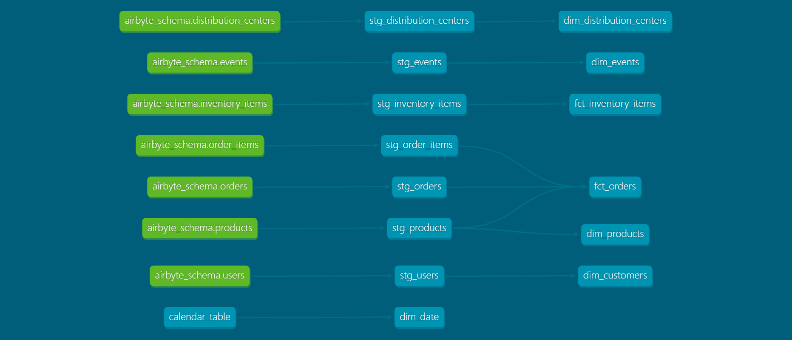

# DBT Proof of Concept

## Table of Contents

- [Overview](#overview)
- [DAG](#dag)
- [Dataset](#dataset)
- [Installation](#installation)
- [Usage](#usage)
- [Project Structure](#project-structure)
- [Conclusion](#conclusion)

## Overview 

This project showcases a proof of concept for implementing a dimensional modeling strategy for an eCommerce store called TheLook. The data for this project was loaded from BigQuery into Snowflake using Airbyte. The tables used for this exercise were `distribution_centers`, `events`, `inventory_items`, `orders`, `products`, `order_items`, and `users`. 

## DAG 

## Dataset 

The dataset used for this exercise was "TheLook," which is a fictitious eCommerce clothing site developed by the Looker team and can be found among BigQuery's public datasets.

## Installation 

To use this project, you'll need to have DBT installed on your machine. Please refer to the [DBT documentation](https://docs.getdbt.com/dbt-cli/installation/) for installation instructions.

You'll also need to have Snowflake credentials set up on your machine, as well as an Airbyte account to load the data into Snowflake. Please refer to the [Snowflake documentation](https://docs.snowflake.com/en/user-guide/python-connector-install.html) and [Airbyte documentation](https://docs.airbyte.io/integrations/sources/bigquery) for more information on how to set up these components.

## Usage 

### DBT Cloud

The easiest way to run this project is in DBT Cloud. Simply create a new project in DBT Cloud, connect it to your GitHub repository, and configure your Snowflake credentials. DBT Cloud will handle the rest, including running the models, tests, and documentation generation.

### DBT Core

If you prefer to run this project in DBT Core, you'll need to have DBT installed on your machine. Please refer to the [DBT documentation](https://docs.getdbt.com/dbt-cli/installation/) for installation instructions.

 You'll need to set up a `profiles.yml` file with your Snowflake credentials. Please refer to the [DBT documentation](https://docs.getdbt.com/reference/warehouse-profiles/snowflake-profile/) for more information on how to set up this file.

You'll also need to set up a Python virtual environment and install the project dependencies. Here's how:

1. Clone this repository to your local machine.
2. Navigate to the root directory of the project.
3. Create a new Python virtual environment by running `python -m venv venv`.
4. Activate the virtual environment by running `source venv/bin/activate` (on Mac/Linux) or `venv\Scripts\activate` (on Windows).
5. Install the project dependencies by running `pip install -r requirements.txt`.
6. Open the `dbt_project.yml` file and update the Snowflake credentials with your own.
7. Run `dbt seed` to load the seed data into the Snowflake database.
8. Run `dbt run` to execute the models and transform the data.
9. Run `dbt test` to run tests on the transformed data.
10. Run `dbt docs generate` to generate documentation for the models.
11. Run `dbt docs serve` to view the documentation in your browser.

## Project Structure 

The project consists of the following main directories:

- `dbt_project.yml`: Project configuration file
- `analysis/`: Directory for ad-hoc SQL queries
- `data/`: Directory for raw input data
- `models/`: Directory for data models
  - `schema.yml`: Schema definition file for data models
  - `*.sql`: SQL files defining the data models
- `macros/`: Directory for DBT macros
  - `*.sql`: SQL files defining the macros
- `seeds/`: Directory for seed data
  - `schema.yml`: Schema definition file for seed data
  - `*.csv`: CSV files containing seed data
- `tests/`: Directory for tests
  - `schema.yml`: Schema definition file for tests
  - `*.sql`: SQL files defining the tests

## Conclusion 

This proof of concept demonstrates the use of DBT to transform and model data from an ecommerce store. By organizing the models into subdirectories based on business processes, it is easy to navigate and understand the data transformation pipeline. The generated documentation provides a clear understanding of the models and the data they represent.